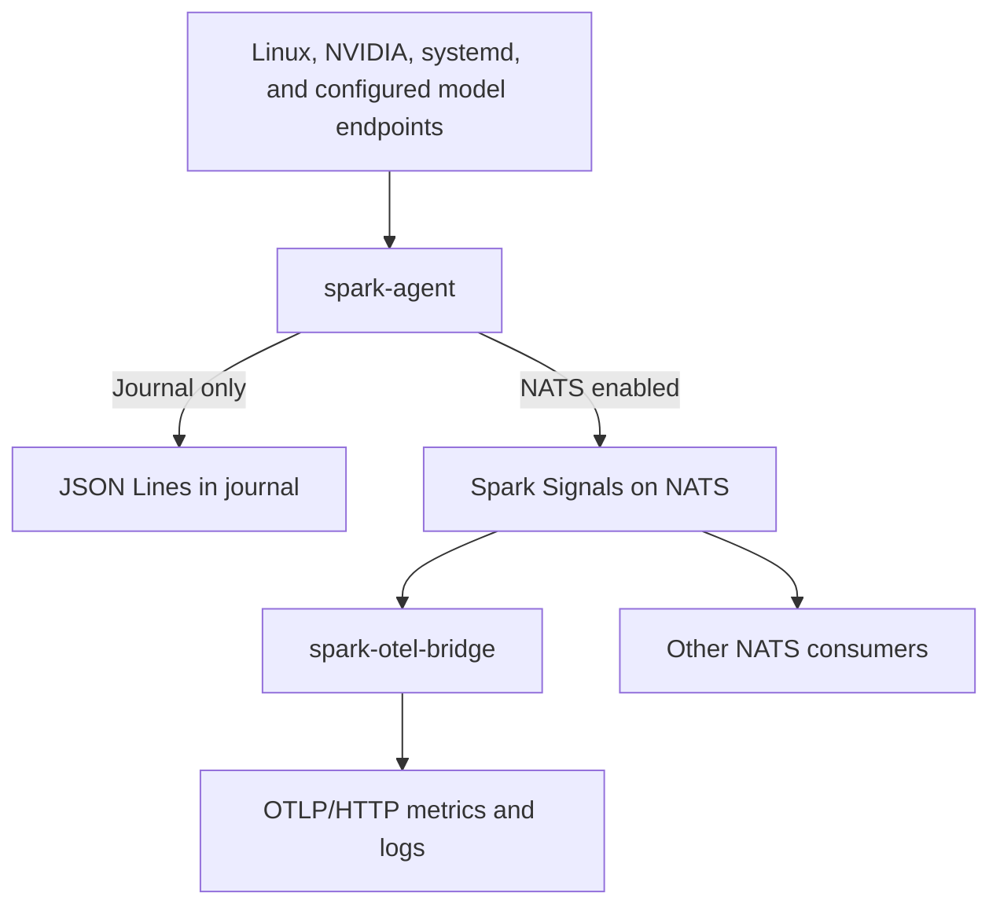

# Spark Signals: First Steps

Spark Signals monitors the health of NVIDIA DGX Spark systems. It collects Linux system and NVIDIA GPU telemetry, watches explicitly configured `systemd` services, and reports operational signals from LLM inference servers.

This guide takes you from a fresh checkout to a running local installation. You will build Spark Signals on the Spark, inspect one collection cycle, configure the host agent, and install it as a `systemd` service. NATS and OpenTelemetry are optional and can be added later when you are ready to send telemetry beyond the machine.

> **Project status**
>
> Spark Signals is currently a prototype with a production-style system-service layout. Linux, NVIDIA, NATS, OTLP, service, and model-server collection paths are implemented, but the repository roadmap still lists longer soak testing, final resource budgets, broader operational hardening, and a built-in UI as future work. Treat a successful installation as the beginning of local acceptance, not the end of it.

Run the commands below from the repository root unless a section says otherwise.

## What you are installing

In this guide, **agent** means the host-monitoring process that runs on each Spark, not an LLM agent. Spark Signals has two executables with deliberately separate jobs:



The two useful operating modes are therefore:

1. **Journal-only:** install only the host agent configuration. The agent writes its JSON Lines signal stream to standard output, which `systemd` captures in the journal.
2. **NATS with optional OTLP:** configure the agent to publish to NATS. From there, configure the bridge to export to an OTLP destination, attach other NATS consumers, or do both.

The bridge is an optional NATS consumer, not a direct connection from the agent. When enabled, it subscribes to the agent's NATS subjects and converts the signals it receives into OTLP metrics and logs. Other consumers, such as a future Spark Signals UI, can subscribe to the same subjects alongside the bridge; Core NATS delivers a copy to each ordinary subscriber. Core NATS does not retain message history, so consumers receive live signals while they are connected. The bridge receives nothing while the agent is operating in journal-only mode.

Spark Signals does not start inference services. It observes only the `systemd` units and model endpoints named in its configuration.

## A few things to have around

The host needs:

- Linux with `systemd` and `sudo` or equivalent root access for the system installation;
- Git;
- a Rust toolchain that supports the Rust 2024 edition, with Cargo, `rustfmt`, and Clippy;
- the ordinary native build environment needed by Rust dependencies, including a compiler, linker, and C/CMake tooling;
- for useful GPU readings, a working NVIDIA driver with local NVML and/or `nvidia-smi` access.

The full host-validation path also uses `jq`, `file`, `awk`, and `ss`. Docker is needed for the repository's containerized NATS tests; it is not required for the normal installation or the Python-based mock OTLP test.

A short preflight catches missing build tools and driver problems before the release build:

```bash
git --version
rustc --version
cargo --version
cargo fmt --version
cargo clippy --version
cc --version
cmake --version
pkg-config --version
systemctl is-system-running
nvidia-smi --query-gpu=name,driver_version --format=csv,noheader
```

The build-tool commands must all print versions, and the Rust toolchain must support the Rust 2024 edition. `systemctl` should be able to contact the system manager; `running` is the expected result, while `degraded` is a reason to inspect `systemctl --failed` before installing another service. The NVIDIA query should identify `NVIDIA GB10` and report a driver version. If that query fails, you can still build Spark Signals and inspect Linux telemetry, but do not expect GPU telemetry to be ready. The release build and one-shot collection below are the authoritative checks; this preflight only exposes missing prerequisites early.

## Clone and build on the machine that will run it

Start by cloning the repository somewhere comfortable:

```bash
mkdir -p ~/projects
cd ~/projects
git clone https://github.com/robbiemu/spark-signals.git
cd spark-signals
```

Build the complete release workspace on the Spark:

```bash
cargo build --release --workspace
```

This native build produces the Linux AArch64 executables used by the installer and verifies that the host's build dependencies are available.

## Say hello before installing anything

Before creating services or machine configuration, ask the agent for one collection cycle:

```bash
./target/release/spark-agent \
  --once \
  --stdout \
  --site home \
  --node spark-01
```

The output is JSON Lines: several self-contained JSON objects, one per line. A one-shot run normally includes agent status and inventory followed by metric batches for the available collection domains.

The output is intentionally literal. An unsupported or temporarily unavailable reading has `value: null` together with a quality such as `unsupported`, `error`, or `stale`. Spark Signals does not quietly turn missing information into a believable-looking zero.

CPU utilization is the classic first-run example. Utilization describes a change between two readings, so the first sample has no baseline. The agent reports that state as unavailable rather than claiming the machine was at zero percent CPU. Several cumulative counters behave the same way on their first reading.

If the sample contains Linux memory and CPU observations, the basic host collection path is working. NVIDIA inventory or at least one measured GPU value confirms the GPU path. Individual unsupported or unavailable GPU fields are not by themselves failures. If NVIDIA inventory is absent or every GPU observation is unavailable, see [GPU inventory or measured values are missing](#gpu-inventory-or-measured-values-are-missing).

## Prepare the host configuration

`agent.toml` holds the structured monitoring configuration for `spark-agent`. `agent.env` is named for the environment variables supplied to that process, including the node identity and optional NATS connection settings.

Use `deploy/runtime` to prepare this host's configuration. It is a Git-ignored staging directory in the checkout, so the host identity, endpoint settings, and environment-based credentials do not enter source history. During system installation, the installer copies `agent.toml`, `agent.env`, and the optional `bridge.env` into `/etc/spark-signals`; the services read those installed copies rather than the files in the checkout. Keep `deploy/runtime` for validation and future updates, and run the installer again after changing a staged file.

Create it without overwriting anything that may already exist:

```bash
set -euo pipefail
umask 077

if test -L deploy/runtime; then
  printf 'deploy/runtime must not be a symlink.\n' >&2
  exit 1
fi

if test -e deploy/runtime && ! test -d deploy/runtime; then
  printf 'deploy/runtime must be a directory.\n' >&2
  exit 1
fi

mkdir -p deploy/runtime
chmod 700 deploy/runtime

if test -L deploy/runtime/agent.toml; then
  printf 'deploy/runtime/agent.toml must not be a symlink.\n' >&2
  exit 1
elif ! test -e deploy/runtime/agent.toml; then
  cp deploy/example-config/agent.toml deploy/runtime/agent.toml
elif ! test -f deploy/runtime/agent.toml; then
  printf 'deploy/runtime/agent.toml must be a regular file.\n' >&2
  exit 1
fi

if test -L deploy/runtime/agent.env; then
  printf 'deploy/runtime/agent.env must not be a symlink.\n' >&2
  exit 1
elif ! test -e deploy/runtime/agent.env; then
  install -m 600 /dev/null deploy/runtime/agent.env
elif ! test -f deploy/runtime/agent.env; then
  printf 'deploy/runtime/agent.env must be a regular file.\n' >&2
  exit 1
fi

chmod 600 deploy/runtime/agent.toml deploy/runtime/agent.env
```

The installer requires these to be regular files and deliberately rejects symlinks.

### Tailor `agent.toml`

Open `deploy/runtime/agent.toml`. The example names two `systemd` services and two SGLang endpoints only to demonstrate the file's shape. Replace them with services and endpoints that exist on this machine, or remove all `[[service]]` and `[[llm]]` sections for now. See [Configured service probes](service-probes.md) for selecting `[[service]]` units and [LLM service adapters](llm-adapters.md) for configuring `[[llm]]` backends, endpoints, authentication, and metric mappings.

A host-only configuration may contain just:

```toml
hardware_capabilities_dir = "/etc/spark-signals/hardware-capabilities"
signal_policies_dir = "/etc/spark-signals/signal-policies"
```

> [!IMPORTANT]
> *Keep passwords, API keys, authorization headers, and other secrets out of `agent.toml`; place them in protected files referenced by path.*

A stopped inference server does not block Linux or NVIDIA collection. The configured endpoint remains visible with an unavailable/error observation.

### Give the node a stable identity

Put the node identity in `deploy/runtime/agent.env`:

```dotenv
SPARK_SITE=home
SPARK_NODE=spark-01
```

For more than one Spark, prepare this file independently on each host. Use the same site for nodes that belong together and a unique node value for every Spark. For example, the second Spark could use:

```dotenv
SPARK_SITE=home
SPARK_NODE=spark-02
```

Use only ASCII letters, numbers, `_`, and `-`. Treat both values as stable identifiers: they become part of NATS subjects, and the node value is carried into exported host identity.

Each Spark needs its own agent installation. Combining their signals also requires a separately operated shared NATS broker with TLS and distinct publish-only credentials for each node; the included loopback broker is not a multi-node configuration. This guide does not provision that shared broker. Review [NATS credentials and subject permissions](nats-credentials.md) and the [security model](security-model.md) before planning a multi-host deployment.

The remaining steps operate on one Spark at a time and use `spark-01` in the examples. Repeat the host-local steps on each additional Spark with that host's identity and, where applicable, credentials; shared broker and bridge placement are deployment-wide decisions handled separately.

At this point, choose where the signal stream should go.

## Path A: keep everything local in the journal

For the smallest installation, leave all NATS variables out of `agent.env`.

When no NATS URL is configured, the agent automatically writes its signal stream to standard output. Under the installed system service, those JSON Lines appear in:

```bash
journalctl -u spark-agent.service
```

This path needs no broker, bridge, collector, or inference server. It is a good first installation because it separates host collection from every downstream dependency.

One behavior is worth remembering: after you add `NATS_URL`, standard-output signal emission is no longer automatic. The service journal will still contain process messages and errors, but the full signal stream moves to NATS unless the agent is run manually with `--stdout`.

## Path B: publish through NATS

When a broker is running on the same Spark, add its connection settings to `deploy/runtime/agent.env`:

```dotenv
SPARK_SITE=home
SPARK_NODE=spark-01

NATS_URL=nats://127.0.0.1:4222
NATS_USER=your-agent-user
NATS_PASSWORD=put-the-real-value-in-the-file-not-in-git
```

The loopback URL applies only when the agent and broker run on the same host. The agent identity should be allowed to publish only its own prefix:

```text
spark.v1.home.spark-01.>
```

It does not need subscribe permission. Give the bridge a separate NATS identity with the inverse permissions: subscribe to the required Spark subjects and publish nothing.

Both executables also accept a `.creds` file through `NATS_CREDENTIALS`. That is the preferred direction when several hosts share a broker. Keep each credential outside the repository and readable only by the corresponding service identity. The installed services use `ProtectHome=yes`, so do not point them at a credential left beneath a login account's home directory. See [NATS credentials and subject permissions](nats-credentials.md) before arranging a multi-host broker.

> [!IMPORTANT]
> *Do not place secrets in command-line arguments or embed them in the NATS URL.*

## Add the OTLP bridge only when NATS is working

The bridge subscribes to Spark Signals on NATS and translates them into OpenTelemetry metrics and logs. Restarting the bridge does not need to interrupt host collection, and restarting the agent does not directly control the bridge.

Create its protected environment only when both a NATS broker and an OTLP destination are available:

```bash
set -euo pipefail

if test -L deploy/runtime/bridge.env; then
  printf 'deploy/runtime/bridge.env must not be a symlink.\n' >&2
  exit 1
elif ! test -e deploy/runtime/bridge.env; then
  install -m 600 deploy/example-config/bridge.env deploy/runtime/bridge.env
elif ! test -f deploy/runtime/bridge.env; then
  printf 'deploy/runtime/bridge.env must be a regular file.\n' >&2
  exit 1
fi
chmod 600 deploy/runtime/bridge.env
```

For a conventional OTLP/HTTP collector, edit the file along these lines:

```dotenv
SPARK_OTEL_TARGET=standard

OTEL_EXPORTER_OTLP_ENDPOINT=http://collector.example:4318
OTEL_EXPORTER_OTLP_PROTOCOL=http/protobuf

NATS_URL=nats://127.0.0.1:4222
NATS_USER=your-bridge-user
NATS_PASSWORD=put-the-real-value-in-the-file-not-in-git
```

The agent and bridge must point to the same broker, and the agent must actually be configured to publish there. The standard target takes ordinary endpoint and header settings from the OpenTelemetry SDK environment. The bridge currently exports OTLP over HTTP/protobuf, so keep the protocol set to `http/protobuf`.

When no OTLP destination exists yet, leave `deploy/runtime/bridge.env` absent. The installer still copies the bridge binary but deliberately keeps `spark-otel-bridge.service` disabled.

Maple is available as a built-in authenticated target, but its credential is a root-owned, mode-`0600` file managed outside the repository. Its contents do not belong in `bridge.env`. Follow the [Maple target guide](maple-integration.md) rather than adapting the standard example by hand. Other conventional collectors normally use the [standard target](otel-target-plugins.md).

## Run the native validation gates

Before giving the build to `systemd`, run the repository checks on the Linux host:

```bash
set -euo pipefail

cargo fmt --all -- --check
cargo clippy --workspace --all-targets -- -D warnings
cargo test --workspace
cargo build --release --workspace
bash -n deploy/*.sh
git diff --check
file target/release/spark-agent target/release/spark-otel-bridge
```

On a DGX Spark, `file` should identify both release binaries as Linux ELF AArch64 executables. A successful build on another machine is useful feedback, but it is not the artifact being installed here.

If `bridge.env` exists, run the bridge's non-exporting target-plugin preflight:

```bash
sudo systemd-run --quiet --wait --collect --pipe \
  --property=Type=oneshot \
  --property=EnvironmentFile="$PWD/deploy/runtime/bridge.env" \
  "$PWD/target/release/spark-otel-bridge" --validate-config
```

This command does not start the long-running bridge, connect to NATS, or send telemetry. For target plugins such as Maple, it validates the plugin-owned credential and endpoint contract. For the standard target, it primarily validates target selection and rejects settings belonging to the wrong plugin; the OpenTelemetry SDK still owns ordinary endpoint processing. In neither case is this proof that a remote collector has accepted data.

## Install Spark Signals as a system service

Everything so far has been source work, local configuration, and validation. The installer changes system users, `/usr/local/bin`, `/etc/spark-signals`, and system `systemd` units.

> [!IMPORTANT]
> Review scripts before running them with root privileges.

```bash
sudo ./deploy/install-system.sh "$PWD"
```

The installer:

- creates `spark-signals-agent` and `spark-signals-bridge` system accounts;
- adds the agent account to available `video` and `render` groups;
- copies both binaries to `/usr/local/bin`;
- installs configuration beneath `/etc/spark-signals` and replaces the files in its managed hardware-capability and signal-policy directories;
- installs the system units;
- enables and restarts the agent;
- validates and enables the bridge only when `deploy/runtime/bridge.env` exists;
- otherwise disables the bridge service.

The login account owns the source checkout but is not required by the running installation. No lingering user manager is needed.

The bridge unit starts with narrowly bounded privilege so a target plugin can prepare a protected credential when necessary. The process then permanently drops to `spark-signals-bridge` before initializing NATS or OpenTelemetry.

### Migrating an older user service

If this replaces an earlier `systemctl --user` installation, remain logged in as the old service user so its user manager is available, then pass that login name as the second argument to the installer you reviewed above:

```bash
sudo ./deploy/install-system.sh "$PWD" "$USER"
```

The installer disables the corresponding user units as it moves the agent to the system service.

## Listen for the new heartbeat

Check the agent first:

```bash
systemctl is-enabled spark-agent.service
systemctl is-active spark-agent.service
journalctl -u spark-agent.service -n 50 --no-pager
```

When `bridge.env` was installed, check the bridge separately:

```bash
systemctl is-enabled spark-otel-bridge.service
systemctl is-active spark-otel-bridge.service
journalctl -u spark-otel-bridge.service -n 50 --no-pager
```

You can confirm the live process identities without exposing configuration:

```bash
agent_pid=$(systemctl show -p MainPID --value spark-agent.service)
ps -o user=,group=,comm= -p "$agent_pid"

if systemctl is-active --quiet spark-otel-bridge.service; then
  bridge_pid=$(systemctl show -p MainPID --value spark-otel-bridge.service)
  ps -o user=,group=,comm= -p "$bridge_pid"
fi
```

The repository's host validation script provides a useful final sniff test:

```bash
./deploy/validate-host.sh "$PWD"
```

It compares reported Linux memory with `/proc/meminfo`, verifies the quality attached to null readings, and checks that the running agent has no listening socket. It expects the release binary in this checkout and uses `jq` and `ss`.

An enabled, active bridge proves that configuration was accepted well enough for the process to remain running. It does **not** prove that the remote collector or backend accepted telemetry. Complete that final check at the destination: inspect collector logs or query the backend for this node's metrics and Spark bridge logs.

## Learn to trust unavailable readings

Unavailable observations are part of the model, not clutter to be scrubbed away.

Common examples include:

- the first CPU utilization and counter-delta readings, which are `stale` while a baseline is established;
- a configured model endpoint that is stopped or unreachable, which is reported with `value: null` and `quality=error`;
- an NVML property the GPU does not implement, which is reported as `unsupported`.

> [!TIP]
> **Advanced:** Run `spark-agent --discover-signals` during a representative workload when you want evidence about repeated unavailable readings. Timed discovery observes raw collector output before policy suppression and produces a reviewable policy file identifying signals that never yielded a usable value or never changed during the window. It does not alter the running policy automatically. See [Timed discovery](signal-policies.md#timed-discovery) for the complete procedure.

Hardware capability profiles let the agent avoid repeatedly calling known-unsupported NVML properties. Transient failures such as permission problems, timeouts, or GPU loss remain visible and retryable. See [Hardware capability profiles](hardware-capabilities.md).

## Update an existing installation

Use this workflow when Spark Signals is already installed as a system service and you want to deploy a selected Git revision. The steps preserve host-specific files, verify or recover the staged configuration, rebuild and reinstall the binaries, and check the updated services. For a configuration-only change, edit the appropriate file in `deploy/runtime`, repeat its validation or preflight, and rerun the installer without changing Git revisions.

> [!NOTE]
> The examples below assume that terminal output may be retained by tools such as `script`, shell tracing, remote-session logging, CI, or a coding agent. They inspect paths, metadata, and environment key names without printing secret values. This is intentionally conservative even when a person is working directly at an unrecorded terminal.

### Select the source revision

Git carries the program and safe examples. The ignored `deploy/runtime` directory holds the operator-managed staging copies of `agent.toml`, `agent.env`, and the optional `bridge.env`. The installer copies those files to `/etc/spark-signals`, and the system services read the installed copies from there. Preserve the staging copies because they are the input to future installations and updates.

Do not overwrite runtime files with examples during an update. Avoid destructive source-cleaning commands—especially `git clean -x` or `git clean -fdx`—because they can remove ignored deployment files.

For a repeatable deployment, select an exact commit SHA rather than installing an unrecorded branch tip. The following workflow fetches a trusted remote, refuses tracked local changes, verifies that the requested commit is present in that remote's history, and switches without a reset or forced checkout:

```bash
set -euo pipefail

cd ~/projects/spark-signals

test "$(uname -s)" = Linux
test "$(uname -m)" = aarch64

git status --short --untracked-files=all

if ! git diff --quiet || ! git diff --cached --quiet; then
  printf 'Tracked changes are present; stop and review them.\n' >&2
  exit 1
fi

remote=origin
requested_commit='<paste the full 40-character commit SHA here>'

if ! [[ "$requested_commit" =~ ^[0-9a-fA-F]{40}$ ]]; then
  printf 'Requested commit must be a full 40-character SHA.\n' >&2
  exit 1
fi

git fetch --prune "$remote"
target_commit=$(git rev-parse --verify "${requested_commit}^{commit}")

containing_refs=$(
  git for-each-ref \
    --format='%(refname:short)' \
    --contains "$target_commit" \
    "refs/remotes/$remote/"
)

if test -z "$containing_refs"; then
  printf 'Requested commit is not contained in the fetched remote.\n' >&2
  exit 1
fi

git switch --detach --no-overwrite-ignore "$target_commit"
test "$(git rev-parse HEAD)" = "$target_commit"
```

`--no-overwrite-ignore` matters here: Git normally permits a checkout to overwrite an ignored file when the target commit contains the same path. With that option, `git switch` refuses the conflict instead, and the ignored runtime files remain in place.

### Verify the staged configuration

Check only their presence and metadata; do not print their values:

```bash
for runtime_file in \
  deploy/runtime/agent.toml \
  deploy/runtime/agent.env; do
  if test -L "$runtime_file" || ! test -f "$runtime_file"; then
    printf 'Required runtime file is missing, not regular, or symlinked: %s\n' \
      "$runtime_file" >&2
    exit 1
  fi
  if ! git check-ignore -q "$runtime_file"; then
    printf 'Runtime file is not ignored by Git: %s\n' "$runtime_file" >&2
    exit 1
  fi
  stat -c '%n: type=%F mode=%a owner=%U:%G' "$runtime_file"
done

if test -e deploy/runtime/bridge.env || test -L deploy/runtime/bridge.env; then
  if test -L deploy/runtime/bridge.env || ! test -f deploy/runtime/bridge.env; then
    printf 'Bridge runtime environment is not a regular file.\n' >&2
    exit 1
  fi
  if ! git check-ignore -q deploy/runtime/bridge.env; then
    printf 'Bridge runtime environment is not ignored by Git.\n' >&2
    exit 1
  fi
  stat -c '%n: type=%F mode=%a owner=%U:%G' deploy/runtime/bridge.env
fi
```

When diagnostics need to confirm environment shape, print key names only:

```bash
for runtime_env in deploy/runtime/agent.env deploy/runtime/bridge.env; do
  if test -L "$runtime_env"; then
    printf 'Refusing to inspect a symlinked runtime file: %s\n' "$runtime_env" >&2
    exit 1
  fi
  test -f "$runtime_env" || continue
  printf '%s keys:\n' "$runtime_env"
  awk -F= '
    /^[[:space:]]*#/ || /^[[:space:]]*$/ { next }
    /^[A-Za-z_][A-Za-z0-9_]*=/ { print "  " $1 }
  ' "$runtime_env"
done
```

If `agent.toml` is unexpectedly missing but the installed system still has the intended configuration, recover it without displaying it:

```bash
if test -L deploy/runtime/agent.toml || test -e deploy/runtime/agent.toml; then
  printf 'Refusing to overwrite the existing agent.toml path.\n' >&2
  exit 1
fi

sudo install \
  -o "$(id -un)" \
  -g "$(id -gn)" \
  -m 600 \
  /etc/spark-signals/agent.toml \
  deploy/runtime/agent.toml
```

Do not replace a missing `agent.env` or `bridge.env` with an empty file merely to make the installer run. Recover protected settings through the operator's secret-management process or by deliberately restoring the installed copy to the trusted deployment account without printing it.

Apply only configuration migrations documented for the selected revision. Do not guess renamed keys, copy authorization headers into environment files, or reconstruct endpoint and service names from memory.

### Rebuild and reinstall

Now repeat the native checks, build the release binaries on this host, and run the bridge preflight when configured:

```bash
set -euo pipefail

cargo fmt --all -- --check
cargo clippy --workspace --all-targets -- -D warnings
cargo test --workspace
cargo build --release --workspace
bash -n deploy/*.sh
git diff --check
file target/release/spark-agent target/release/spark-otel-bridge

if test -f deploy/runtime/bridge.env; then
  sudo systemd-run --quiet --wait --collect --pipe \
    --property=Type=oneshot \
    --property=EnvironmentFile="$PWD/deploy/runtime/bridge.env" \
    "$PWD/target/release/spark-otel-bridge" --validate-config
fi
```

An updated checkout can contain an updated installer, so review it again before installing the update:

```bash
sudo ./deploy/install-system.sh "$PWD"
```

### Verify the updated installation

Afterward, repeat the service, journal, process-identity, host-validation, and destination-acceptance checks. Record at least:

```bash
git rev-parse HEAD
uname -srm
systemctl is-enabled spark-agent.service
systemctl is-active spark-agent.service
systemctl is-enabled spark-otel-bridge.service || true
systemctl is-active spark-otel-bridge.service || true
```

A completion note should distinguish what was actually observed from what was merely prepared. Record the deployed commit, architecture, runtime-file readiness by path or key name only, validation results, service state, and external telemetry acceptance when it was genuinely checked. Do not include secret values.

## Troubleshooting

Here are some troubleshooting tips that hopefully will help you out or at least not make things worse.

### The agent is active, but the full JSON stream disappeared from the journal

Check whether `NATS_URL` is now set. With NATS configured, full standard-output signal emission is no longer automatic. Inspect the NATS stream, or run a separate one-shot command with `--stdout` for diagnostics.

### The bridge is active, but the backend is empty

Work from left to right:

1. confirm the agent has NATS configured;
2. confirm the agent can publish its own subject;
3. confirm the bridge can subscribe to that subject;
4. inspect `journalctl -u spark-otel-bridge.service`;
5. verify the collector endpoint, authentication, name resolution, and backend query.

Service activity alone is not end-to-end acceptance.

### The bridge is installed but disabled

That is expected when `deploy/runtime/bridge.env` was absent during the most recent installer run. Create and preflight the protected file, then run the installer again.

### A service cannot read a credential file

Do not weaken `ProtectHome` or make the credential broadly readable. Move or install the credential into a system path accessible only to the intended service identity, then update the protected environment file with that installed path.

### GPU inventory or measured values are missing

Repeat the driver query from the preflight:

```bash
nvidia-smi --query-gpu=name,driver_version --format=csv,noheader
```

It should identify `NVIDIA GB10` and report a driver version. If it fails, restore NVIDIA driver and device access before debugging Spark Signals. If it succeeds, repeat the one-shot collection and inspect the `sample.nvidia` points. `NVML_AND_NVSMI_UNAVAILABLE`, `NVSMI_QUERY_FAILED`, and `NVML_DEVICE_COUNT_FAILED` identify collection-path failures. An `unsupported` quality on an individual point instead means that the GPU or driver does not provide that property; other NVIDIA inventory and measured points should still appear.

### Optional service or model readings are unavailable

Check that `agent.toml` names the intended unit and endpoint. Do not start a large inference service merely to make an optional metric appear. An inactive service or unreachable endpoint is a valid observation.

## Further reading

- [Spark Signals schema v1](schema-v1.md)
- [Metric catalogue](metric-catalogue.md)
- [Security model](security-model.md)
- [NATS credentials and subject permissions](nats-credentials.md)
- [OTLP target plugins](otel-target-plugins.md)
- [Maple target plugin](maple-integration.md)
- [LLM service adapters](llm-adapters.md)
- [Configured service probes](service-probes.md)
- [Hardware capability profiles](hardware-capabilities.md)
- [Signal emission policies](signal-policies.md)
- [Project roadmap](../ROADMAP.md)

---

That separation is the heart of the setup. The repository carries the program and safe examples. The Spark keeps its own identity and secrets. Once the two are introduced, Spark Signals can get on with the pleasantly boring job of watching the machine.
